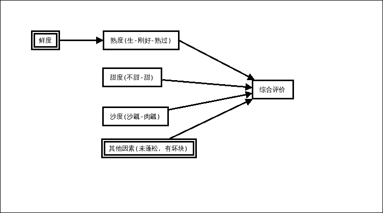
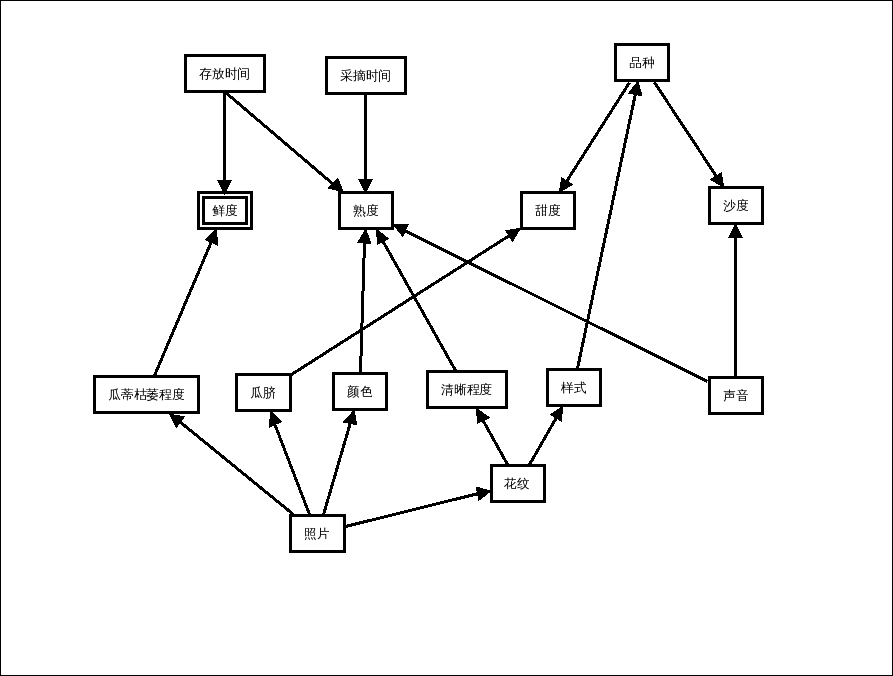

西瓜熟了
========
    一个用来识别西瓜生熟程度及口味的APP

### 评价西瓜的指标
    
    1. 我们可以从这些方面评价西瓜的品质：
        * 鲜度：是否新鲜
        * 熟度：是否不熟，是否过熟
        * 甜度：是否甜
        * 沙度：肉瓤还是沙瓤
    2. 鲜度有些特殊
       * 鲜度和熟度相互影响，随着存放时间的延长，熟度不够的瓜变熟了，鲜度略有损失；但是如果采摘时候过生，也可能放坏了也熟不了
       * 除非非常不新鲜,变质了。否则人们对鲜度不是非常敏感，不容易评价
    3. 熟度也会影响甜度和沙度。随着西瓜变熟，甜度和沙度都会增加
    4. 人们都喜欢新鲜的西瓜，即使不大敏感；熟度是不过生不过熟最好；甜度一般都喜欢甜的西瓜；沙度就看个人喜好了，可能很多人喜欢沙瓤，但是也有人不喜欢，不能简单用好/坏评价
    5. 还有一些其他因素会影响西瓜的品质。这些因素属于 *坏* 的品质，只要有，基本上这个西瓜就属于 *坏* 西瓜了，这些因素包括有坏块，瓜质不蓬松等等。所以要引入一个综合评价项，如果一个西瓜各项都很好，但是综合评价很差，那么就是出现这些其他因素了，即:
       > `其他因素 = 综合评价 - 鲜度 - 熟度 - 甜度 - 沙度`
       
### 如何来评价
    
    1. 影响上述评价指标的内在属性：
       * 存放时间影响鲜度
       * 采摘时间和存放时间共同影响熟度
       * 甜度和沙度基本由西瓜的品种决定，也许还受种植方式的影响
    2. 可以获取的西瓜的外部信息只有图像和声音
    3. 声音的判断：
       * 熟度：生瓜声脆，熟瓜声闷
       * 沙度：沙瓤瓜比较空
    4. 图像可以进一步获取的信息有瓜蒂的枯萎程度、瓜脐的形状、西瓜的颜色和花纹信息（包括花纹的样式和条纹的清晰程度）
    5. 瓜蒂的枯萎程度（如果有瓜蒂的话）可以反映鲜度
    6. 瓜脐的大小据说可以判断甜度
    7. 西瓜的整体颜色随着西瓜变熟有变化
    8. 西瓜花纹随着西瓜变熟而清晰
    9. 不同的西瓜品种其花纹样式不同
